# 🤖 From 2D Pixels to 3D Grasping: A Hybrid Approach

When building an industrial robot arm system, one of the biggest challenges isn't just knowing *what* an object is—it's knowing *where* it is and *how it's rotated*.

A standard object detector might tell you "There is a bottle here," but if your robot tries to grab it without knowing it's tilted at 45 degrees, the grasp will fail. That's the problem this project solves.

---

## 📖 The Story

### The Problem: "The World isn't Axis-Aligned"
Traditional object detection models (like standard YOLO) output bounding boxes that are always upright (axis-aligned). But in the real world, objects—especially trash on a conveyor belt or parts in a bin—can be in any orientation.


*(standard box vs OBB box)*

For a robot to successfully pick up an object, it needs two critical pieces of information that standard models miss:
1.  **Precise Real-World Coordinates (x, y)**: Not just pixels on a screen.
2.  **Orientation ($ \theta $)**: The exact angle of the object.

### The Solution: Meeting in the Middle
We developed a **Hybrid Computer Vision System** that combines the strengths of two powerful technologies:


*   **YOLOv8-OBB (Oriented Bounding Box)**: Instead of standard boxes, we use the OBB version of YOLOv8. This allows the model to learn and predict the rotation of objects directly.
*   **ArUco Markers**: We use these fiducial markers to create a "Bird's Eye View" transformation. This effectively turns our camera into a metric measuring device, translating pixel coordinates into real-world millimeters.

By fusing these technologies, we get a robust system where the camera sees an object, YOLO determines its class and angle, and ArUco mapping tells the robot exactly where to move.

---

## 🧠 The Journey: Data is King

### 1. Acquiring the Data
We couldn't rely on public datasets for our specific needs, so we built our own. We captured **626 original images** of bottles and cans under controlled lighting conditions to simulate a factory environment.

### 2. The Tooling Dilemma: Roboflow vs. CVAT
We initially tried **Roboflow** for labeling. While great for standard detection, we found its polygon tool for OBB labeling was often imprecise—human errors led to "wobbly" polygons that confused the model.


We switched to **CVAT (Computer Vision Annotation Tool)**. Why?
*   CVAT has a **Rotated Bounding Box** tool.
*   This ensures labels are perfectly rectangular and symmetric, just rotated.
*   It exports precise angle data that we critically needed.

### 3. Automating the Pipeline
Labeling is only half the battle. CVAT's XML output isn't compatible with YOLOv8-OBB out of the box. Instead of manual conversion, we wrote a custom **Automation Pipeline** (see `ArUco_Yolov8_OBB-Copy1.ipynb`).

```mermaid
graph TD
    A[📷 Raw Images] -->|Labeling| B(CVAT Tool)
    B -->|Export| C[XML Annotations]
    C -->|Input| D{Python Auto-Pipeline}
    D -->|Merge| E[Merged XML]
    D -->|Trig Calc| F[Rotated Corners x4]
    D -->|Normalize| G[YOLO OBB Format]
    G -->|Split 80/20| H[📂 Train/Val Folders]
    H -->|Ready| I[🚀 YOLOv8 Training]
```



The script handles:
1.  **Merges** multiple annotator files into one.
2.  **Calculates** the 4 corner points of rotated boxes using trigonometry.
3.  **Normalizes** the data into the YOLO format.
4.  **Splits** the dataset into Train (80%) and Validation (20%) automatically.

---

## 🚀 How to Replicate

1.  **Get the Code**:
    ```bash
    git clone https://github.com/tachin-r/ArUco-based-YOLOv8-OBB-Localization-for-Robotics.git
    ```

2.  **Prepare the Environment**:
    ```bash
    pip install -r requirements.txt
    ```

3.  **Train the Model**:
    We use the `yolov8s-obb.pt` (small) model as our starting point.
    ```python
    from ultralytics import YOLO
    model = YOLO('yolov8s-obb.pt')
    model.train(data='Trash_Dataset_(80_20)/dataset.yaml', epochs=100, imgsz=640)
    ```

---

## � Results

Our model (`s_80_20_run`) successfully learned to distinguish and orient bottles and cans with high precision. The switch to OBB significantly improved the "graspability" metric compared to standard bounding boxes.

*(Insert your metrics or confusion matrix image here)*

---

## 🌐 Real-World Integration

To demonstrate the practical application of this system, we built a **Web Application Interface** that connects to the model in real-time.
https://g7tuesm.consolutechcloud.com/aruco_real.html


This interface allows users to:
1.  **Calibrate**: Set the physical workspace dimensions (e.g., 650mm x 813mm) for ArUco mapping.
2.  **Monitor**: View the live camera feed with ArUco markers detected.
3.  **Process**: See the YOLOv8-OBB inference results with oriented bounding boxes, real-world coordinates (mm), and rotation angles.

This end-to-end integration proves the model's readiness for deployment in robotic sorting tasks.

---

## 🔮 What's Next?
*   **Real-time ROS Integration**: Connecting this vision system to a physical Dobot Magician.
*   **Depth Estimation**: experimenting with stereo cameras for 3D picking.

---

## 📂 Repository Structure

```
/
├── notebooks/              # Jupyter Notebooks for training & research
│   └── ArUco_Yolov8_OBB...
├── web_app/                # Web Application Code
│   ├── backend/            # Python API Server (Flask)
│   └── frontend/           # Web Interface (HTML/JS)
├── asset/                  # Images and resources
├── deployment.md           # Guide for deploying to the server
└── README.md               # This documentation
```
